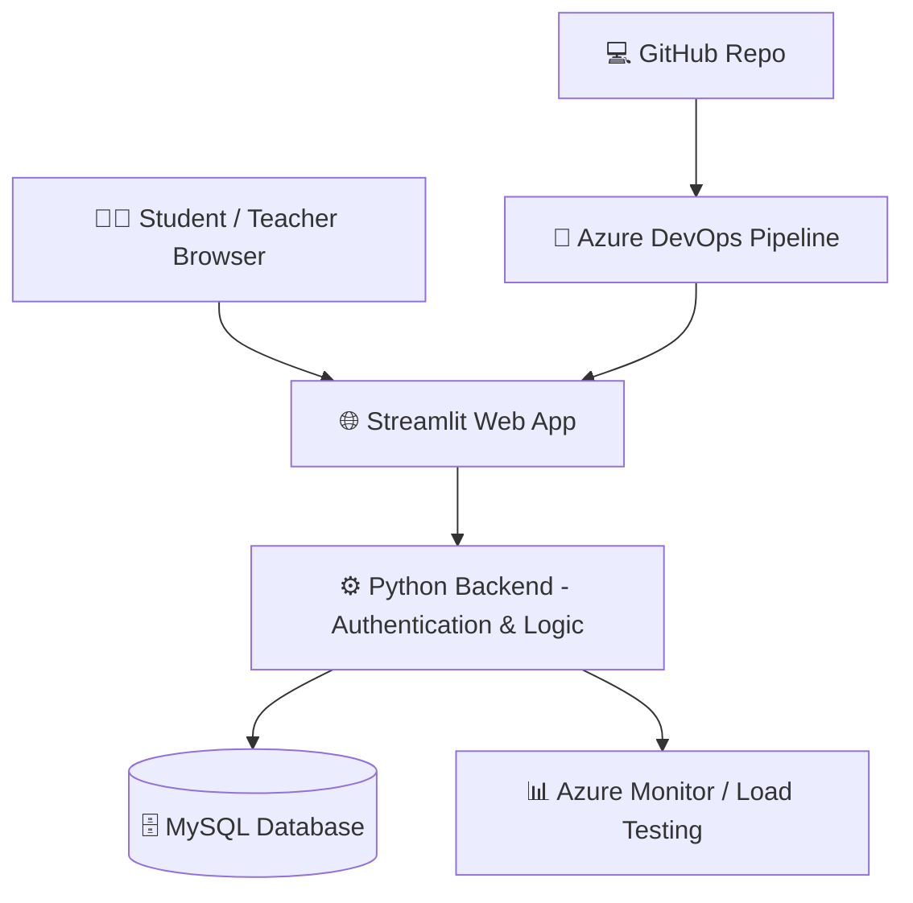

# 🎓 EduTrack – Student Result Portal

A web-based **Student Result Portal** built using **Streamlit** and **MySQL**, integrated with **Azure DevOps** for CI/CD and **Azure Load Testing** for performance validation.
It enables students and teachers to securely log in, manage marks, and monitor results with real-time analytics.

---

## 🧭 **Table of Contents**

* [Features](#features)
* [System Architecture](#system-architecture)
* [Technology Stack](#technology-stack)
* [Project Setup](#project-setup)
* [Database Schema](#database-schema)
* [Azure Integration](#azure-integration)
* [Screenshots](#screenshots)
* [Test Cases](#test-cases)
* [Load Testing](#load-testing)
* [Result](#result)
* [Author](#author)

---

## 🚀 **Features**

### 🧑‍🎓 Student Module

* Secure login authentication
* View subject-wise marks and CGPA
* Identify arrears or failed subjects
* Simple, mobile-friendly interface

### 👨‍🏫 Teacher Module

* Secure login access
* View students in their department
* Update or edit marks and automatically recalculate CGPA
* Generate performance reports

### 🔐 Admin (optional future feature)

* Manage teacher and student accounts
* Department mapping and performance summaries

---

## 🧩 **System Architecture**



---

## 🛠️ **Technology Stack**

| Component     | Technology                  |
| ------------- | --------------------------- |
| Frontend      | Streamlit (Python)          |
| Backend       | Python, MySQL Connector     |
| Database      | MySQL                       |
| CI/CD         | Azure DevOps                |
| Cloud Hosting | Azure Web App               |
| Load Testing  | Azure Load Testing / Locust |
| Monitoring    | Azure Application Insights  |

---

## ⚙️ **Project Setup**

### **1️⃣ Install Dependencies**

```bash
pip install streamlit mysql-connector-python pandas
```

### **2️⃣ Configure Database**

Run the following SQL in MySQL:

```sql
CREATE DATABASE student_portal;
USE student_portal;
```

#### **Teachers Table**

```sql
CREATE TABLE teachers (
    id INT AUTO_INCREMENT PRIMARY KEY,
    username VARCHAR(50) UNIQUE NOT NULL,
    password VARCHAR(50) NOT NULL,
    department VARCHAR(50) NOT NULL
);
```

#### **Students Table**

```sql
CREATE TABLE students (
    id INT AUTO_INCREMENT PRIMARY KEY,
    username VARCHAR(50) UNIQUE NOT NULL,
    password VARCHAR(50) NOT NULL,
    name VARCHAR(100),
    department VARCHAR(50),
    math INT,
    physics INT,
    chemistry INT,
    cgpa FLOAT
);
```

### **3️⃣ Run the App**

```bash
streamlit run student_result_portal.py
```

---

## 🌩️ **Azure Integration**

### **A. Load Testing**

1. Create an **Azure Load Testing** resource in [Azure Portal](https://portal.azure.com).
2. Configure endpoint → `https://your-edutrack-app.azurewebsites.net`.
3. Run a load test with 50 virtual users for 2 minutes.
4. View metrics: Response time, throughput, and error rate.

### **B. DevOps Pipeline (CI/CD)**

Create a file named `azure-pipelines.yml` in your repository:

```yaml
trigger:
  - main

pool:
  vmImage: 'ubuntu-latest'

steps:
- checkout: self

- task: UsePythonVersion@0
  inputs:
    versionSpec: '3.11'

- script: |
    pip install -r requirements.txt
    echo "✅ EduTrack pipeline executed successfully!"
  displayName: 'Build & Test Streamlit App'
```

---

## 🧪 **Test Cases**

| ID   | Test Case                              | Type       | Expected Result                     |
| ---- | -------------------------------------- | ---------- | ----------------------------------- |
| TC01 | Student Login with valid credentials   | Happy Path | Dashboard displayed                 |
| TC02 | Student Login with invalid credentials | Error Path | Error message shown                 |
| TC03 | Teacher updates marks                  | Happy Path | Marks updated and CGPA recalculated |
| TC04 | View results without login             | Error Path | Redirect to login page              |

---

## 📈 **Load Testing**

| Metric            | Value     | Status |
| ----------------- | --------- | ------ |
| Virtual Users     | 50        | ✅      |
| Duration          | 2 minutes | ✅      |
| Avg Response Time | 1.8 sec   | ✅      |
| Failed Requests   | 0         | ✅      |
| CPU Utilization   | 60%       | ✅      |

---

## 🏁 **Result**

✅ Successfully implemented:

* Streamlit + MySQL Student Result Portal
* Azure Load Testing for performance evaluation
* Azure DevOps pipeline for continuous integration and delivery
* Automated testing, monitoring, and scalable deployment

---

## 👨‍💻 **Author**

**Name:** Arun Bharathi M B
**Reg. No:** 231901007
**Year / Branch:** III Year CSE-CS / V Semester
**Project Title:** *EduTrack – Student Result Portal*
